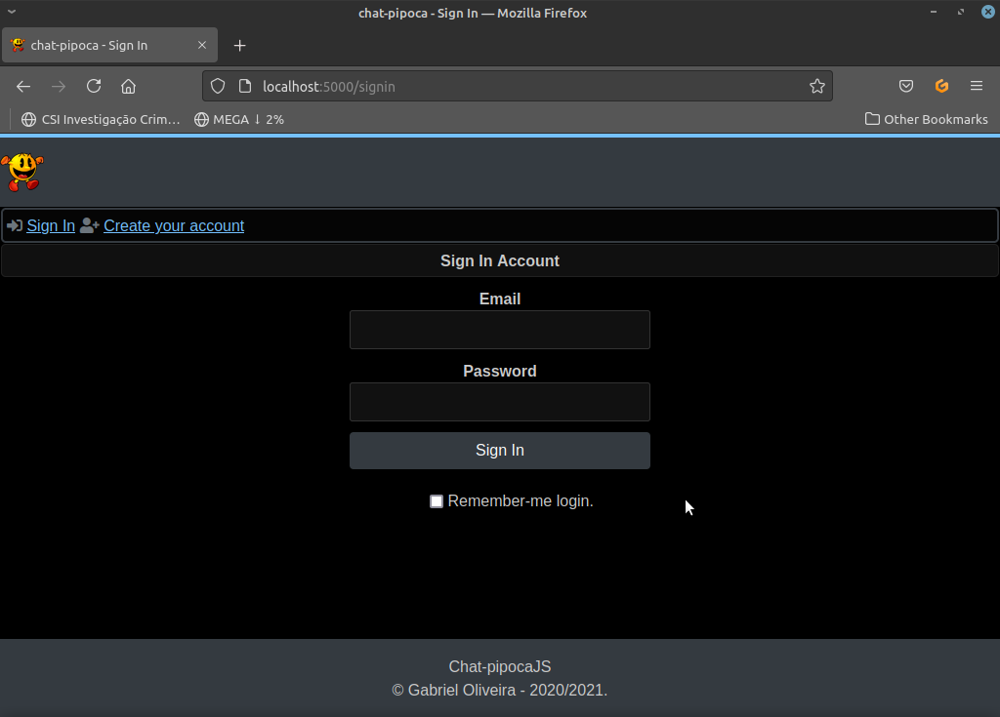
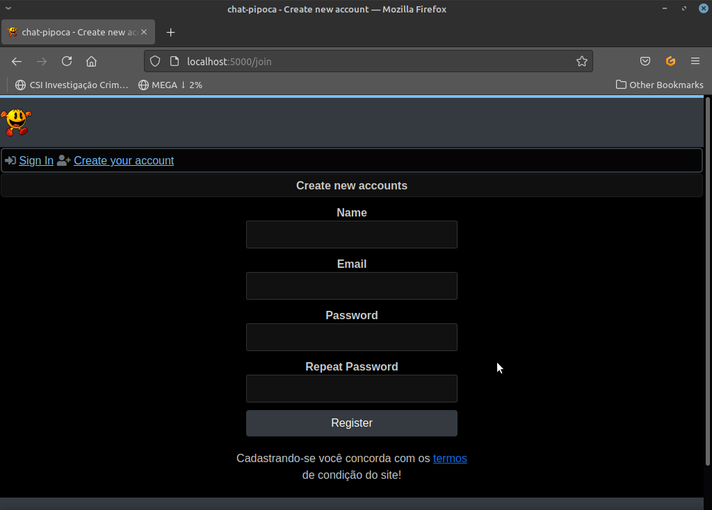

<h1 align="center">
  
  <br>
  Chat-Pipoca
</h1>

## Project Description
<p align="center">wap community remade in adonisjs</p>

<div align="center">
  
  
  
  
  
</div>

<h4 align="center"> 
	🚧  Under construction...  🚧
</h4>

<div align="center">
  
  
</div>

### Prerequisites

Before starting, you will need to have the following tools installed on your machine:
[Git](https://git-scm.com), [Node.js](https://nodejs.org/en/).
Also it's nice to have an editor to work with the code like [VSCode](https://code.visualstudio.com/)

### Run project

```
# Clone repository
$ git clone https://github.com/gabriel4g/chat-pipoca.git

# Access the project folder
$ chat-pipoca

# Install project dependencies 

# npm
$ npm install

# or yarn
$ yarn install
```

#### for project configuration access the [wiki](https://github.com/gabriel4g/chat-pipoca/wiki).

### 🛠 technologies

The following tools were used in the construction of the project:

- [Node.js](https://nodejs.org/en/)
- [Adonis](https://adonisjs.com/)
- [TypeScript](https://www.typescriptlang.org/)
- [Bootstrap](https://getbootstrap.com/)
- [Sqlite](https://sqlite.org/)

# Author

<br>
<a href="https://github.com/gabriel4g">Gabriel Oliveira</a>

<div>
  
  
  
</div>
